# HA Card Playground — by VDG7

**v0.7.93 · Live card preview with detachable window**

> The native Home Assistant card editor hides the preview when you expand the code area. **HA Card Playground** solves this by giving you a dedicated panel with a full YAML editor and a real-time card preview — side by side, or detached on a second screen.

---

## ✨ Features

### 🖊️ YAML Editor

- **CodeMirror 6** — professional code editor, fully embedded in the HA sidebar panel
- **Line numbers** with active line gutter highlight
- **Active line highlight** — subtle background on the current line
- **Keyboard shortcuts** fully isolated from Home Assistant via `stopPropagation` — no conflicts with HA hotkeys

#### Syntax Highlighting

Two complete color themes, switchable in Settings:

**Dark theme** (Noctis Solarized — default):
| Element | Color |
|---------|-------|
| YAML keys | `#59bec2` — cyan |
| Plain values / scalars | `#b58900` — yellow |
| Quoted strings | `#b58900` — yellow |
| `true` / `false` / `yes` / `no` / `on` / `off` / `null` / `~` | `#d33682` — magenta (distinct from other values) |
| Comments | `#586e75` — gray, italic |
| JS keywords (`if`, `let`, `return`…) | `#cb4b16` — orange |
| JS numbers | `#d33682` — magenta |
| JS operators | `#839496` — gray |
| JS identifiers / variables | `#e8eced` — white |
| Editor background | `#002b36` — Solarized dark |
| Gutter background | `#073642` |

**Light theme**:
| Element | Color |
|---------|-------|
| YAML keys | `#0550ae` — blue |
| Plain values / scalars | `#116329` — green |
| Booleans / null | `#8250df` — purple |
| Comments | `#6e7781` — gray, italic |
| JS keywords | `#cf222e` — red |
| JS numbers | `#953800` — brown |
| JS operators | `#0550ae` — blue |
| JS identifiers | `#1a1a1a` — near-black |

#### JavaScript inside `[[[...]]]`

Cards like `button-card` support inline JavaScript expressions wrapped in `[[[` … `]]]`. The editor detects these blocks inside YAML scalar nodes (`BlockLiteralContent`, `Literal`, `QuotedLiteral`) and applies full JavaScript syntax highlighting inside them, while keeping YAML highlighting outside. Implemented via `parseMixed` from `@lezer/common`.

#### Color Swatches

Any hex color value in the YAML (`#rgb`, `#rrggbb`, `#rrggbbaa`) renders a small **colored square** inline, just before the value:
- Clicking the square opens the **native browser color picker**
- While the picker is open, moving the color updates the hex value in the editor **in real time**
- On picker close, the value is finalized
- Supports 3-digit shorthand (`#fff` → picker shows `#ffffff`)
- Alpha channel (`#rrggbbaa`) is shown in the swatch but the picker edits only the `#rrggbb` part

#### Font Size

- `A−` / `A+` buttons: range 10–28 px, step 1 px
- Current size shown between the two buttons (`14px` by default)
- `↺` resets to 14 px
- Size is persisted in `localStorage` (`card-playground-font-size`) and restored on reload
- Changing font size reconfigures the CodeMirror theme via `Compartment` — gutter and layout reflow automatically

---

### 🔍 YAML Search

Click **🔍 Chercher** in the editor toolbar to open the search popup, anchored just below the font-size controls (`A−` / `14px` / `A+` / `↺`).

- **Auto-search** — results appear automatically from 2 characters, occurrence centered in the editor in real time
- **Navigate occurrences** — `↓` button or `↓` key: next match · `↑` button or `↑` key: previous match · automatic wrap-around
- **Enter** — confirms a suggestion or jumps to the next occurrence
- **Escape** or `✕` — closes the popup and clears the highlight

**Autocomplete suggestions** (priority order):
1. Entity IDs referenced in the current YAML (same extraction as `✓ Vérifier`)
2. Card types referenced in the current YAML
3. Raw words from the YAML text as fallback

**Triple highlight on the found occurrence:**
- 🔴 **Red bold line number** (via `GutterMarker` + `gutterLineClass`)
- 🔴 **Red left border** on the full line (`Decoration.line`)
- 🔴 **Red background on the searched word** (`Decoration.mark`)
- Automatic vertical centering in the editor
- Highlight is cleared when the popup closes

---

### 📂 Drag & Drop File Mode

Drop any `.yaml` file directly onto the editor area to load its content.

- **CRLF normalization** — Windows and Samba-mounted files (`\\NAS\config`) are normalized to LF automatically
- **File badge** `📁 filename.yaml` appears in the toolbar — indicates file mode is active
- **`⬇ Fichier`** button — downloads the modified content as the same filename via `<a download>`. The original file is **never overwritten automatically**
- Download is **disabled** (red) if the YAML checker finds errors — fix all errors before saving back
- **`🗑 Vider`** button — clears the editor completely and resets file mode
- The editor's auto-save to `localStorage` is paused while in file mode (to avoid polluting the snapshot with config file content)

---

### ✓ YAML Checker

Click **`✓ Vérifier`** in the toolbar to run a comprehensive validation. A dropdown panel shows each result. The button color reflects the worst severity found: green ✓ / orange ⚠ / red ✗.

An **auto-check** runs automatically 800 ms after each edit.

| Check | Severity |
|-------|----------|
| Full YAML syntax parse | error |
| Tab characters (forbidden in YAML) | error |
| Irregular indentation (not a multiple of base indent) | warn |
| HA root keys indented by mistake (`sensor:`, `homeassistant:`…) | warn |
| `{{` / `}}` misaligned across lines (Jinja2 templates) | warn |
| `[[[` / `]]]` misaligned across lines (JS button-card) | warn |
| Native HA card types recognized | ok / error |
| HACS card types loaded in browser | ok / warn |
| Entity IDs exist in HA | ok / error |
| Services called exist in HA | ok / warn |
| `!include` keyword typos | error |
| `!include` missing `.yaml` / `.yml` extension | error |
| `!include` key ↔ path segment coherence | warn |
| HA API config check (`/api/config/core/check_config`) | ok / error / warn |

**Smart skip zones** — the indentation checker ignores content inside:
- `[[[...]]]` blocks (JavaScript — free indentation)
- YAML block scalars after `|` or `>` (Jinja2 templates, CSS, shell scripts…)

**Path-aware `!include` coherence** — all path segments are checked, not just the filename. `carte_multiroom: !include packages/carte_multiroom/_package.yaml` is valid because the directory segment `carte_multiroom` matches the key.

---

### 💾 Save & Restore

- **Auto-save** — every keystroke writes the current YAML to `localStorage` key `card-playground-yaml`. Can be toggled off in Settings (useful if a broken YAML causes a crash on startup)
- **💾 Sauver** — writes a manual snapshot to `card-playground-snapshot`. The button briefly turns amber with a "✓ Sauvé" label for 1 second
- **↩ Restaurer** — loads `card-playground-snapshot` back into the editor. The button briefly turns accent-color with "✓ Restauré" for 1 second
- Both snapshot and auto-save survive browser reloads and tab closes

---

### 📎 Clipboard & Formatting

- **⎘ Copier** — copies the **current selection** if text is selected, or the **entire YAML** otherwise. Uses `document.execCommand('copy')` with `navigator.clipboard` as fallback. Button turns green with "✓ Copié" for 1 second
- **⎘ Coller** — focuses the CodeMirror editor content area and shows "→ Ctrl+V" for 1.5 seconds as a reminder (browser security prevents programmatic paste)
- **⌥ Format** — parses the YAML then re-serializes it with `indent: 2` and `lineWidth: 0` (no forced line breaks). Invalid YAML is silently ignored. Button turns amber with "✓ Formaté" for 1 second
- **⇥** — indents the current selection or line by 2 spaces (CodeMirror `indentMore`)
- **⇤** — dedents the current selection or line by 2 spaces (CodeMirror `indentLess`)

---

### 🔍 Smart Autocomplete — VS Code-level contextual completions

Twelve distinct completion sources, each triggered in its own context. Hover highlight `#4d78cc` (dark) / `#2563eb` (light), keyboard selection `#268bd2`.

#### `type:` completions

Triggered on any line matching `type:` or `- type:` (including list items inside stacks).

- Lists **35+ native HA card types**: `alarm-panel`, `area`, `button`, `calendar`, `conditional`, `entity`, `gauge`, `glance`, `grid`, `history-graph`, `horizontal-stack`, `humidifier`, `iframe`, `light`, `logbook`, `map`, `markdown`, `media-control`, `picture`, `picture-entity`, `picture-glance`, `plant-status`, `sensor`, `shopping-list`, `statistics-graph`, `thermostat`, `tile`, `todo-list`, `vertical-stack`, `weather-forecast`, `webpage`, and energy cards
- Detects **HACS custom cards** automatically via `window.customCards` — appears as `custom:card-name`, declared name shown in detail column
- Filtering is live: `type: ga` → `gauge`, `type: custom` → HACS cards only
- Native cards boosted above custom cards in ranking (`boost: 2` vs `boost: 1`)

#### Contextual key completions

Triggered at the start of a line (key position — only spaces or `- ` before the word, no `:` before cursor).

**Inside a card block:**
- Detects the card type by scanning **backwards** from the cursor, stopping at the first `type:` line with indentation ≤ cursor — correctly handles nested stacks
- **Auto-triggers on Enter** after a `type:` line — the key list opens immediately without needing `Ctrl+Space`
- Suggests all relevant keys for the detected card type with their type hint in the detail column (e.g. `entity_id — requis`, `boolean`, `object`)
- 24 card types covered with specific key sets

**Inside a `tap_action:` / `hold_action:` / `double_tap_action:` block:**
- Detected via `_getActionBlockAtCursor` — scans backwards to the nearest parent block
- Returns action sub-keys: `action`, `entity`, `service`, `data`, `service_data`, `target`, `navigation_path`, `url`, `confirmation`

#### Auto-indent on Enter after block keys

A custom `Enter` handler (highest priority in the keymap) detects when the cursor is at the end of a line ending with `:` (no value) and automatically indents 2 extra spaces on the next line. Combined with the cascade trigger, pressing Enter after `tap_action:` both indents and immediately opens the action sub-key list — no `Ctrl+Space` needed.

#### Scalar value completions (booleans & enums)

New source `_scalarValueComplete` — triggers immediately after `:` on known keys.

**Boolean keys** (26 recognized) → `true` / `false`: `show_name`, `show_icon`, `show_state`, `show_header`, `state_color`, `show_entity_picture`, `fill_container`, `logarithmic_scale`, `hide_legend`, `dark_mode`, and more.

**Enum keys** → labeled options with descriptions:

| Key | Values |
|-----|--------|
| `secondary_info` | `last-changed`, `last-updated`, `attribute`, `state`, `none`, `entity-id`… |
| `format` | `none`, `relative`, `total`, `date`, `time`, `datetime`, `duration`… |
| `aspect_ratio` | `1/1`, `2/1`, `1/2`, `16/9`, `9/16`, `4/3` |
| `layout` | `vertical`, `horizontal`, `default`, `icon_only`, `name_only`, `label_only`… |
| `chart_type` | `line`, `bar` |
| `period` | `5minute`, `hour`, `day`, `week`, `month` |
| `triggers_update` | `all` + all entity IDs (both sources combined) |

T9-style filtering: typing `tr` after `show_name: ` leaves only `true`; typing `la` after `secondary_info: ` shows `last-changed` and `last-updated`.

#### `action:` value completions

Triggered on `action:` lines inside action blocks.

- 9 values: `none`, `more-info`, `toggle`, `call-service`, `perform-action`, `navigate`, `url`, `assist`, `fire-dom-event`
- Description of each action in the detail column

#### `service:` / `perform_action:` completions

Triggered on `service:` or `perform_action:` lines.

- Reads **all available services** directly from `hass.services` — always up to date with your live HA instance
- Format: `domain.service_name`, domain shown in detail column
- Up to 80 results, live filtering, activates after 2 characters or `Ctrl+Space`

#### Color completions

Triggered on `color:`, `icon_color:`, `card_color:`, `badge_color:`, `label_color:`, `accent_color:`, `background_color:` lines.

- **25 HA named colors** (Material Design + semantic): `red`, `pink`, `purple`, `blue`, `cyan`, `green`, `amber`, `orange`, `warning`, `error`, `success`, `info`, `disabled`, `black`, `white`…
- **CSS variables**: `var(--primary-color)`, `var(--accent-color)`, `var(--error-color)`…

#### `icon:` completions

Triggered on any `icon:` line, after the colon.

- **Full MDI library — 7447 icons** — every icon available in Home Assistant, generated directly from `@mdi/js`
- Each suggestion shows a real **`<ha-icon>` SVG preview** on the right side, in state color (`#59bec2` dark / `#0550ae` light) — no emoji, no text placeholder, the actual rendered icon
- Accepts both `mdi:light` and `light` as input — the `mdi:` prefix is stripped for filtering
- Also activates on HTML template attributes: `icon="mdi:..."`
- Up to 80 results shown, filtered live as you type
- Activates after 2 characters typed, or immediately with `Ctrl+Space`

#### `attribute:` completions

Triggered on `attribute:` or `state_attribute:` lines.

- Reads the **real attributes** of the `entity:` declared in the same card block directly from `hass.states`
- Scans both **above and below** the cursor to find `entity:` (order of keys in YAML doesn't matter)
- Each suggestion shows the **current attribute value** in the detail column (truncated to 40 chars)
- Stops scanning when indentation decreases (left the current card block)

#### Template completions — Jinja2 HA

Triggered inside `{{ ... }}` and `` blocks anywhere in the YAML.

- **35 HA Jinja2 functions**: `states()`, `state_attr()`, `is_state()`, `has_value()`, `now()`, `utcnow()`, `today_at()`, `relative_time()`, `timedelta()`, `float()`, `int()`, `bool()`, `iif()`, `expand()`, `area_id()`, `area_entities()`, `device_id()`, `device_attr()`, `label_id()`, `integration_entities()`, `trigger`, `this`, `namespace()`, `range()`, `dict()`…
- Full function signature shown in detail column
- Works inside `markdown:` card content, `button-card` templates, `conditional:` templates

#### CSS completions — `style: |` blocks

Triggered when the cursor is inside a YAML block scalar opened by `style: |` or `extra_styles: |`.

- Detected via `_getStyleBlockAtCursor` — scans backwards to find the `style: |` ancestor
- **60+ CSS properties**: `background-color`, `border-radius`, `box-shadow`, `display`, `flex`, `padding`, `margin`, `transform`, `transition`, `opacity`, `font-size`, `font-weight`…
- **HA CSS variables**: `--ha-card-border-radius`, `--ha-card-box-shadow`, `--mdc-icon-size`, `--primary-color`, `--state-icon-color`…
- Only activates in property position (before any `:` on the line)

#### Entity ID completions

Triggered on value lines (lines that already contain `:` before the cursor). Does not activate on `type:`, key, `icon:`, `action:`, `service:`, or `attribute:` lines.

- Reads directly from `hass.states` — always up to date with your live HA instance
- **Up to 80 results**, prefix matches ranked higher (`boost: 1`)
- Label: entity ID — color `#e8eced` (dark) / `#1a1a1a` (light)
- Detail: current state + unit of measurement — color `#59bec2` (dark) / `#0550ae` (light)
- No `friendly_name` — avoids visual clutter

#### Autocomplete UI behavior (all sources)

- **Mouse hover** — `requestAnimationFrame` loop reads `getBoundingClientRect()` on all list items, works in both `document` and Shadow DOM `renderRoot`. Highlight applied as inline style (highest priority). Color: `#4d78cc` (dark) / `#2563eb` (light)
- **Keyboard navigation** — `↑` / `↓` to move, `Enter` / `Tab` to accept, `Escape` to close
- List width: minimum 340 px, max height 50 vh, scrollable
- List items: 3 px vertical padding
- `closeOnBlur: false` — list stays open when focus leaves the editor
- `Ctrl+Space` triggers any completion source explicitly at any time

---

### 👁️ Live Card Preview

- Real-time render using Home Assistant's native `createCardElement()` — **pixel-identical to the real dashboard**
- Supports all **native HA cards**, **HACS cards** (button-card, bubble-card, card-mod…), and any custom element registered in the browser
- HACS Lovelace resources (scripts declared in `lovelace/resources`) are loaded automatically via `<script type="module">` — same method HA uses internally
- **In-place update** — if the `type:` hasn't changed, the card is updated via `setConfig()` instead of being recreated, eliminating flickering
- For `custom:` cards: `setConfig()` is called without the `type` key (many cards like button-card reject it)
- **Debounced** — preview updates 400 ms after the last keystroke, preventing excessive re-renders while typing
- Parse errors and missing card types display a native `hui-error-card` (same as HA dashboards)

#### Column Width

Configure the preview width to simulate how the card will look at different grid sizes:

| Preset | Width |
|--------|-------|
| 1 col | 1200 px |
| 2 col | 600 px |
| 3 col | 400 px |
| 4 col | 300 px (HA default) |
| 5 col | 240 px |
| 6 col | 200 px |
| 8 col | 150 px |
| 10 col | 120 px |

Plus a **pixel-precise slider** (100–1600 px) and a **direct numeric input** field. Current width is shown live in the preview toolbar. Setting is persisted in `localStorage`.

---

### 🪟 Detachable Preview Window

- **↗ Détacher** opens the same HA panel URL with `#preview` hash in a new popup window (540×760 px, no browser chrome)
- The detached window runs the **full HA frontend** — `loadCardHelpers()` is available, HACS resources load normally
- **BroadcastChannel API** (`card-playground` channel) syncs YAML and settings between windows in real time
- On open, the detached window sends a `request-yaml` message and the editor replies immediately with the current YAML

#### Zoom controls (detached window)

Fixed bar in the bottom-right corner of the detached window:
- `↺` — reset zoom to 100%
- `−` / `+` — decrease / increase zoom in 25% steps (range: 25%–200%)
- Current zoom percentage displayed between the buttons
- Uses CSS `zoom` property (not `transform: scale`) — scroll behavior remains natural at any zoom level
- When zoom ≠ 100%, a badge **"Aperçu · taille non contractuelle"** appears below the card (15 px, 45% opacity) as a reminder that the displayed size is not the real card size

#### Auto full-screen on detach

Configurable in Settings:
- **Auto** — the editor expands to full width (preview pane hidden) as soon as the detached window opens
- **Manual** — the split stays as-is after detaching

When the detached window is closed (by the user or by `↙ Réintégrer`), the editor automatically restores the split view and re-renders the preview inline.

---

### ↔️ Resizable Split

- Drag the **6 px divider** between editor and preview — range 20%–80% of total width
- The divider highlights in the primary HA color on hover and while dragging
- **◀ Plein écran** button — hides the preview pane and expands the editor to 100% width
- **▶ Aperçu** button — restores the split (appears when in full-screen mode)

---

### ⚙️ Settings Panel

Opens via the **⚙** button in the header. Closes when clicking anywhere outside.

| Setting | Default | Description |
|---------|---------|-------------|
| Largeur colonne Desktop | 300 px | Presets (1–10 col) + slider + numeric input |
| Thème clair | Off | Switches editor and preview to light color theme |
| Sauvegarde automatique | On | Writes YAML to localStorage on every keystroke |
| Éditeur plein écran au détachement | Off | Auto-expands editor when preview is detached |

---

## 📸 Screenshots

### Editor + Live Preview

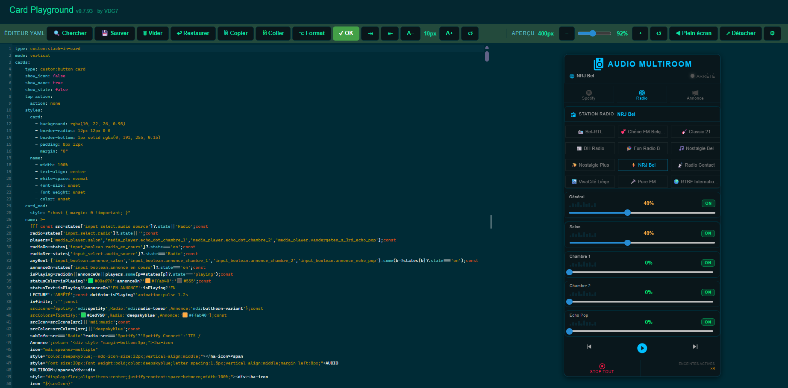

### Full-screen Editor Mode

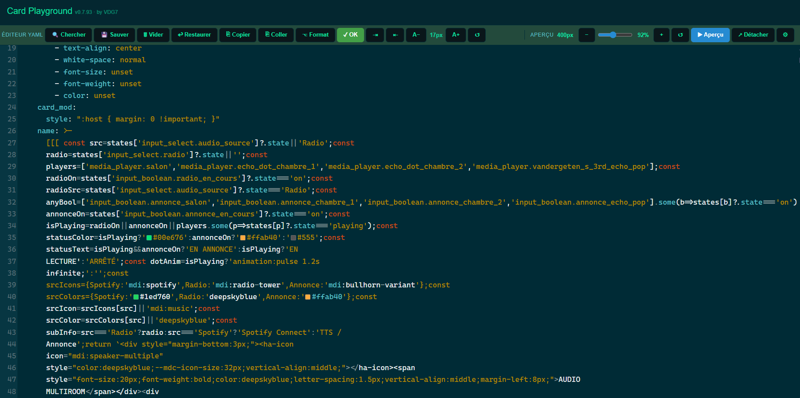

### YAML Search — 🔍 Chercher

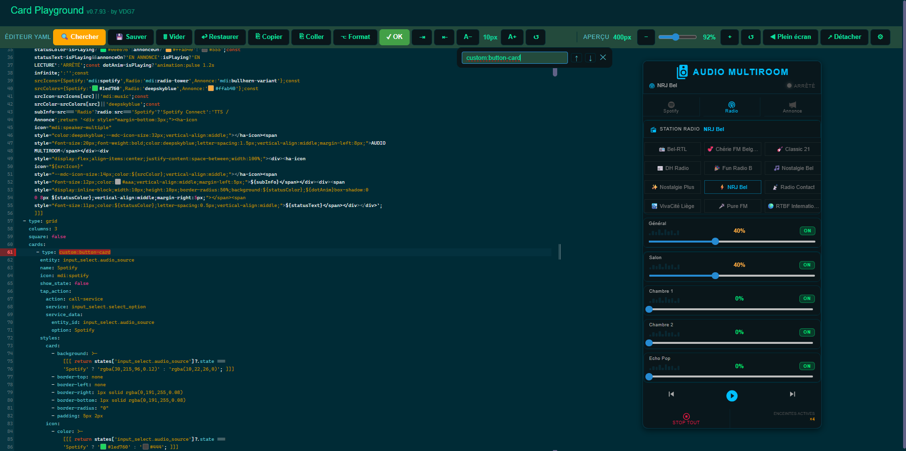

> Click **🔍 Chercher** to open the search popup. Results appear from 2 characters — navigate with `↑` / `↓`. Autocomplete suggests entity IDs and card types from the current YAML. The matched line is highlighted with a red gutter marker, left border, and background.

### Settings Panel

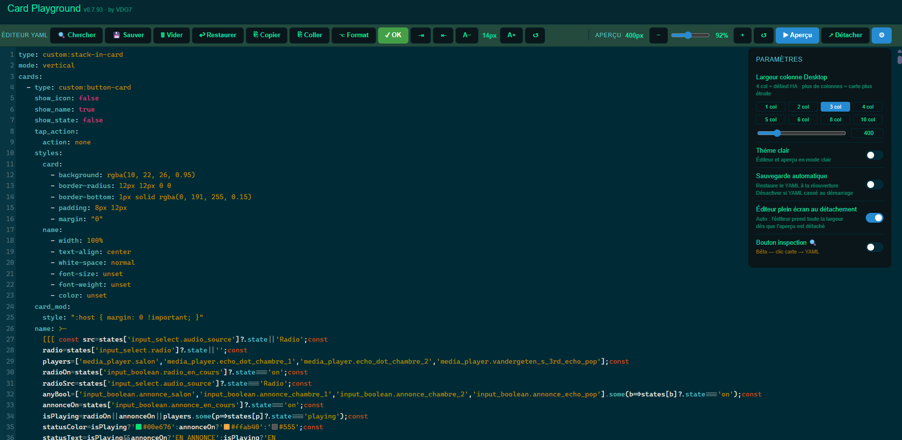

> Column width presets (1–10 col) + pixel slider, light/dark theme toggle, auto-save and auto full-screen on detach.

### YAML Checker — Real-time Error Detection

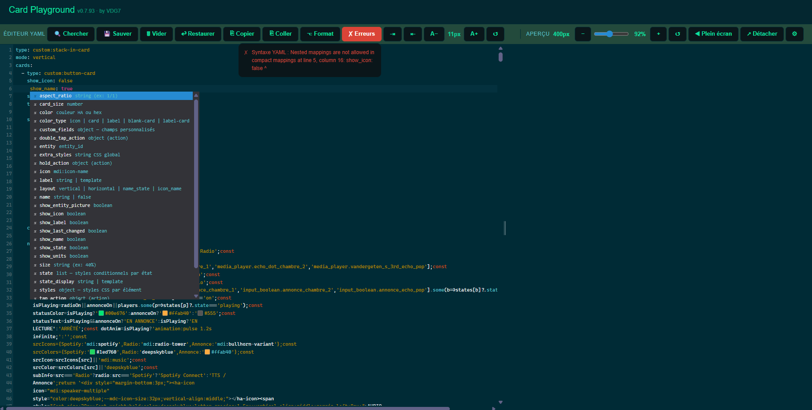

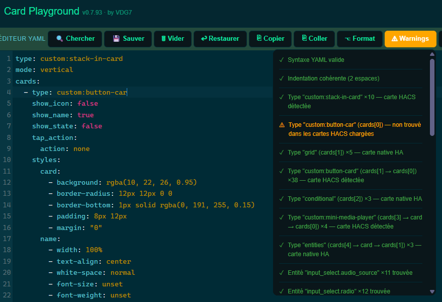

> The **✗ Erreurs** button turns red when issues are detected. Click it to expand the detail panel — errors are clickable and pinpoint the exact line and column. Auto-check runs 800 ms after each keystroke.

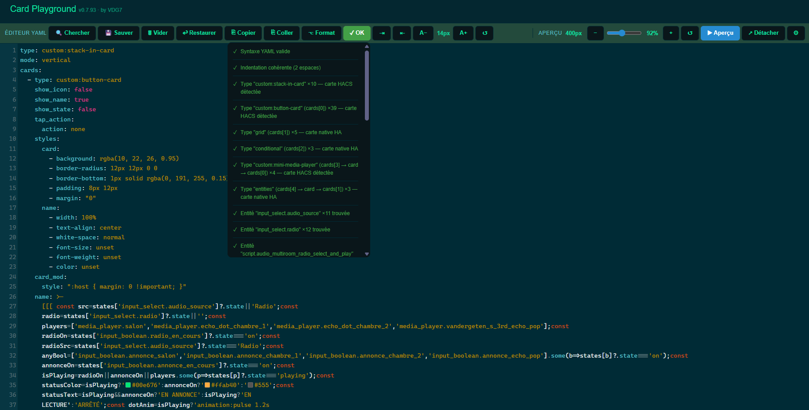

> When all checks pass, the panel lists every validation with its result — YAML syntax, indentation, entity IDs, services, card types, `!include` paths, and more.

### Syntax Highlighting + Inline Color Picker

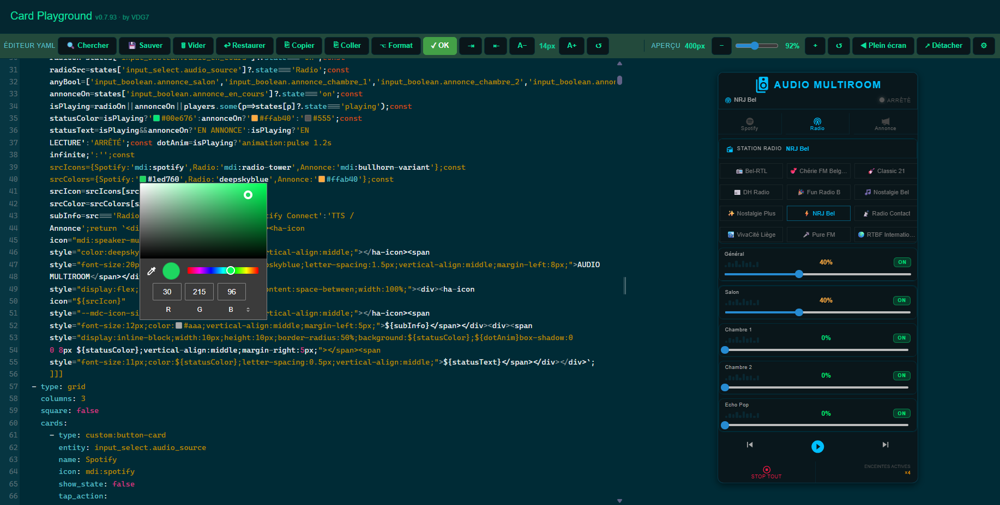

> Full syntax highlighting for YAML, Jinja2 templates and embedded JavaScript. Hex color values (`#rgb`, `#rrggbb`) render an inline color swatch — click it to open the native color picker and update the value in real time.

### Autocomplete — MDI Icon Picker (7447 icons with live SVG preview)

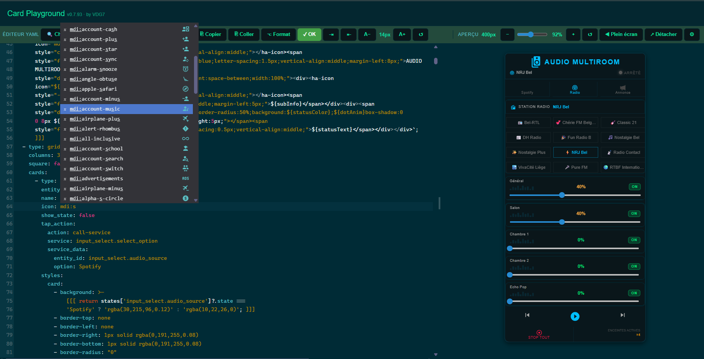

> `icon:` triggers the full MDI icon library — 7447 icons, each with a real `<ha-icon>` SVG preview. Type to filter live.

### Smart Autocomplete — HACS custom cards + YAML checker

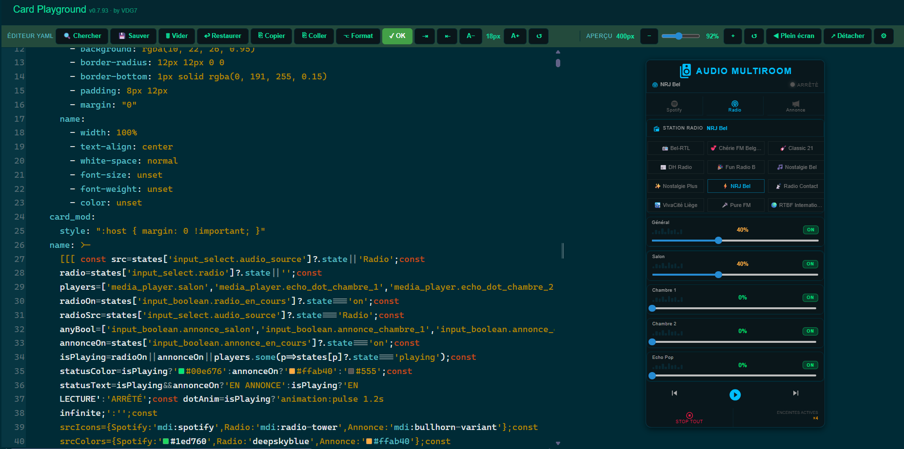

> `type: custom:` triggers live detection of all installed HACS cards. The YAML checker (red **✗ Erreurs** button) flags issues in real time — here the card type is not yet chosen.

### Detachable Preview Window (zoom controls — not actual card size)

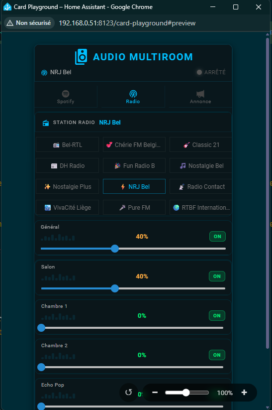

> The detached window can be zoomed (25%–200%) to inspect card details. The badge *"Aperçu · taille non contractuelle"* is automatically shown when zoom ≠ 100% as a reminder that the displayed size is not the real card size.

---

## 📦 Installation via HACS

1. Open **HACS** → **Frontend**
2. Search for **HA Card Playground** and install it
3. Reload Home Assistant
4. Add the panel in your `configuration.yaml`:

```yaml
panel_custom:
  - name: ha-card-playground
    sidebar_title: Card Playground
    sidebar_icon: mdi:palette
    url_path: card-playground
    module_url: /local/community/ha-card-playground/ha-card-playground.js
```

---

## 🚀 Usage

1. Open the **Card Playground** panel from the sidebar
2. Paste or type your card YAML — the preview updates automatically after 400 ms
3. Use **🔍 Chercher** *(Beta)* to search for any text in the YAML, with live highlighting
4. Click **↗ Détacher** to move the preview to a second screen
5. Use **💾 Sauver** before making risky edits, then **↩ Restaurer** if something breaks
6. Use `Ctrl+Space` to trigger autocomplete at any time

---

## ⌨️ Editor Toolbar — Button Reference

Buttons wrap to a second line on narrow windows (responsive flex layout).

| Button | Action | Feedback |
|--------|--------|----------|
| 🔍 Chercher *(Beta)* | Open YAML search popup | Highlighted while open |
| 📁 `name.yaml` | File mode badge (appears after drag & drop) | — |
| ⬇ Fichier | Download modified file | Green "✓ Téléchargé" · Red "✗ Erreurs" if errors |
| 💾 Sauver | Save manual snapshot | Amber "✓ Sauvé" for 1 s |
| 🗑 Vider | Clear editor + reset file mode | — |
| ↩ Restaurer | Restore last snapshot | Accent "✓ Restauré" for 1 s |
| ⎘ Copier | Copy selection or full YAML | Green "✓ Copié" for 1 s |
| ⎘ Coller | Focus editor for Ctrl+V | Blue "→ Ctrl+V" for 1.5 s |
| ⌥ Format | Re-indent / format YAML | Amber "✓ Formaté" for 1 s |
| ✓ Vérifier | Run YAML checker + toggle panel | Green / Orange / Red |
| ⇥ | Indent selection (+2 spaces) | — |
| ⇤ | Dedent selection (−2 spaces) | — |
| A− | Decrease font size (min 10 px) | — |
| `Xpx` | Current font size (read-only) | — |
| A+ | Increase font size (max 28 px) | — |
| ↺ | Reset font size to 14 px | — |

---

## 💾 localStorage Keys

| Key | Content |
|-----|---------|
| `card-playground-yaml` | Current YAML (auto-save) |
| `card-playground-snapshot` | Manual snapshot (💾 Sauver) |
| `card-playground-autosave` | Auto-save toggle (`0` / `1`) |
| `card-playground-desktop-width` | Preview column width (px) |
| `card-playground-auto-full` | Auto full-screen on detach (`0` / `1`) |
| `card-playground-dark` | Dark (`1`) or light (`0`) theme |
| `card-playground-font-size` | Editor font size (px) |

---

## 🛠️ Requirements

- Home Assistant **2023.0.0** or later
- HACS installed

---

## 📝 License

MIT — by VDG7
